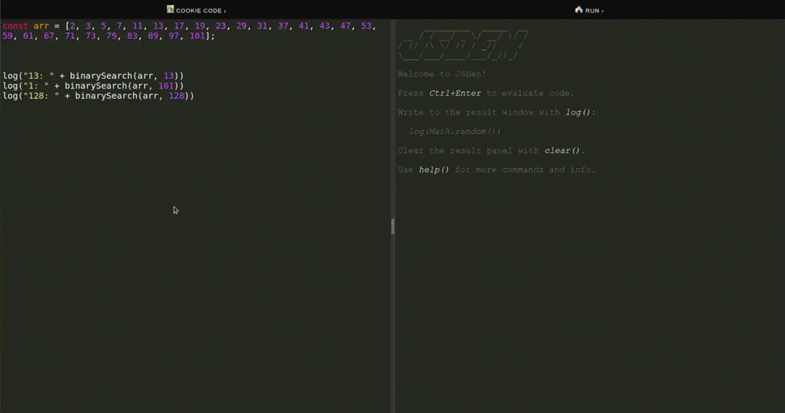

# Cookie Code

## Introduction
This project is a web interface based on the Devneya library, which is specifically designed for code generation. The purpose of this project is to provide a user-friendly platform that allows users to generate code snippets or blocks based on their specific requirements. The implementation includes a cookie code functionality, which dynamically adds a form to the HTML page for user interaction.

Here is an example of the service integration at <a href="https://get-zen-dev.github.io/jsden/" rel="nofollow">jsden.dev</a> playground:



## Getting Started
To use the Cookie Code functionality in your project, follow the steps below:

1. Include the following code to the <body> in your HTML file:
   ```html
    <button class="js-cookie-code-popup-button">Cookie Code</button>
    <script src="https://cdn.jsdelivr.net/gh/get-zen-dev/Devneya@latest/assets/js/cookie-code.js" type="module" class="js-cookie-code-script"></script>
   ```
2. Include the CSS file <head> in your HTML file: 
    ```html
        <link rel="stylesheet" href="https://cdn.jsdelivr.net/gh/get-zen-dev/Devneya@latest/assets/css/cookie-code-style.css">
    ```


## Usage
Once the Cookie Code implementation is added to your HTML file, the following behavior will occur:

- A button with the class `"js-cookie-code-popup-button"` will be displayed on the page.
- When you click on the button, a form will be displayed that will allow you to send a request and copy the received code.